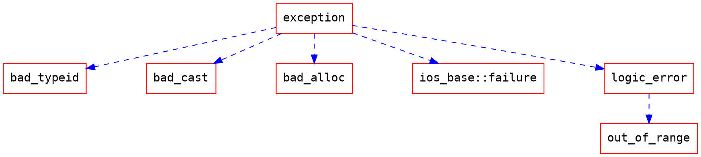

# 北京大學 - C++ 程序設計 (Coursera) C++11新特性

第1～6週[筆記在這](/SXujAxaTR9KkZGFqBUt68g)
第7週[筆記在這](/JPMUh5LvSVeEo0hfWmK7AA)
STL相關[筆記在這](/e00_PVmZQYK9N1CkbIZxtw)

---
## 第10週


1. 統一的初始化方法

   大括號初始化方法(列表初始化)
   ```c
   int arr[3]{1, 2, 3};
   
   vector<int> iv{1, 2, 3};
   
   map<int, string> mp{{1, "a"}, {2, "b"}};
   
   string str{"Hello World"};
   
   // new出來的空間前3個被初始化成1, 2, 3
   int * p = new int[20]{1, 2, 3};    // 動態分配也可以用這種方法初始化
   
   struct A
   {
       int i, j; A(int m,int n):i(m), j(n) { }
   };
   
   A func(int m,int n )
   {
       return {m,n}; // 直接寫一個初始化列表，就能用它生成的A來作為回傳值
   }
   
   int main()
   {
       A * pa = new A {3, 7};
   }
   ```
   
2. 成員變數默認初始值

   ```c
   class B
   {
       public:
           int m = 1234;    // 默認初始值
           int n;
   };
   int main()
   {
       B b;
       cout << b.m << endl; // 輸出 1234
       return 0;
   }
   ```
   
3. auto關鍵字
   
   用於定義變數，編譯器可以自動判斷變數的類型
   
   ```c
   auto i = 100; // i是int
   
   auto p = new A(); // p是A *
   
   auto k = 34343LL; // k是long long
   
   map<string, int, greater<string>> mp;
   for( auto i = mp.begin(); i != mp.end(); ++i)
       cout << i->first << "," << i->second ;
   // i的類型是： map<string, int, greater<string> >::iterator
   
   class A { };
   
   A operator + ( int n, const A & a)
   {
       return a;
   }
   
   template <class T1, class T2>
   auto add(T1 x, T2 y) -> decltype(x + y)
   {
       return x+y;
   }
   
   auto d = add(100, 1.5); // 此時d是double d=101.5
   auto k = add(100, A()); // 此時編譯器會實例化上面的add函數，d是A類型
   ```
   在函數的後面寫上 -> 鍵號可以指名回傳值應該屬於什麼類型，如f()->int
   auto f()->decltype(x+y)會根據x+y表示式的類型決定要返回什麼類型
   
4. decltype關鍵字
   
   求表示式的類型，如：
   ```c
   int i;
   double t;
   struct A { double x; };
   const A* a = new A();
   
   // 下面的陳述句同樣也是定義了變數
   decltype(a) x1; // x1 is A *
   decltype(i) x2; // x2 is int
   decltype(a->x) x3; // x3 is double(A裡面的成員變數3的類型)
   decltype((a->x)) x4 = t; // x4 is double&(多一層括號代表引用)
   ```
   
5. 智慧指標shared_ptr

   * 需要```#include <memory>```
   * 通過shared_ptr的建構子，可以讓shared_ptr物件託管一個new運算子返回的指針，寫法如下：
     ```c
     shared_ptr<T> ptr(new T);
     // T可以是int, char, 類別名稱等各種類型
     
     shared_ptr<int> a = make_shared<int>(10);
     // 也可以用make_shared來建構
     ```
     此後ptr就可以像```T*```類型的指針一樣來使用，即```*ptr```就是用new動態分配的物件，而且不必擔心釋放內存的事(不用手動呼叫delete)
   * 多個shared_ptr物件可以同時託管一個指針，系統會維護一個託管計數。當無shared_ptr託管該指針時，delete該指針。
   * shared_ptr物件不能託管指向動態分配的陣列的指針，否則程式執行會出錯。

   例子：
   ```c
   #include <memory>
   #include <iostream>
   
   using namespace std;
   
   struct A
   {
       int n;
       A(int v = 0):n(v){ }
       ~A() { cout << n << " destructor" << endl; }
   };
   
   int main()
   {
       shared_ptr<A> sp1(new A(2)); // sp1託管A(2)
       shared_ptr<A> sp2(sp1); // sp2也託管A(2)
       cout << "1)" << sp1->n << "," << sp2->n << endl; // 輸出1)2,2
       
       shared_ptr<A> sp3;
       A * p = sp1.get(); // p指向A(2)，p是普通的指針，利用get()來取得sp1託管的指針
       cout << "2)" << p->n << endl;
       
       sp3 = sp1; // sp3也託管A(2)
       cout << "3)" << (*sp3).n << endl; // 輸出2
       
       sp1.reset(); // sp1放棄託管A(2)
       if( !sp1 )
       cout << "4)sp1 is null" << endl; // 這一行會被執行到
       
       A * q = new A(3);
       sp1.reset(q); // sp1託管q
       cout << "5)" << sp1->n << endl; // 輸出3
       
       shared_ptr<A> sp4(sp1); // sp4託管A(3)
       shared_ptr<A> sp5;
       // sp5.reset(q); 不妥，會導致程式出錯
       sp1.reset(); // sp1放棄託管A(3)
       cout << "before end main" <<endl;
       sp4.reset(); // sp1放棄託管A(3)，已經沒人託管A(3)，delete掉
       cout << "end main" << endl;
       return 0; // 程式結束，會delete掉A(2)
   }
   ```
   輸出結果：
   ```
   1)2,2
   2)2
   3)2
   4)sp1 is null
   5)3
   before end main
   3 destructor
   end main
   2 destructor   
   ```
   
   其中，為何```sp5.reset(q);```會導致程式出錯？
   因為p會被delete兩次，如下例：
   ```c++
   #include <iostream>
   #include <memory>
   
   using namespace std;
   
   struct A
   {
       ~A() { cout << "~A" << endl; }
   };
   
   int main()
   {
       A * p = new A;
       shared_ptr<A> ptr(p);
       shared_ptr<A> ptr2;
       ptr2.reset(p); // 並不增加ptr中對p的託管計數
       cout << "end" << endl;
       return 0;
   }
   ```
   以上程式執行結果：
   ```
   end
   ~A
   ~A (此時程式崩潰，原因：double free)
   ```
   主因是使用```reset(p)```時，系統不知道這裡的p跟前面某一個需要的ptr物件所託管的p是不是相同的。
   所以reset盡量使用在某個第一次被託管的指針，或放棄託管時才呼叫。
   
6. unique_ptr

   同shqred_ptr，只是不能多個unique_ptr託管同一個指針
   參考[Smart Pointer 介紹/用法](http://blog.roy4801.tw/2020/06/04/c++/smart_pointer/)
   
   * Use std::unique_ptr for exclusive-ownership resource management
   * unique ownership
     一個資源只會被一個 object 所擁有
   * ```unique_ptr<T>```不能複製(operator=)、不能 copy-construct

   * 只能被 move-construct 
     代表所有權(Ownership)的轉移
   
   用法：
   ```c
   unique_ptr<int> a(new int{10});
   
   unique_ptr<int> b = a; // 這個會噴錯
   
   unique_ptr<int> c;
   c = a; // 這個也會噴錯
   ```
   也可以用make_unique
   ```c
   unique_ptr<int> a = make_unique<int>(1);
   unique_ptr<int> b = std::move(a); // 將a指向的1所有權轉移給b
   
   if(a)
       std::cout << "a is good" << '\n';
       
   if(b)
       std::cout << "b is good" << '\n';
   ```
   
   由於a已經不擁有所有權，故上述程式輸出：
   ```
   b is good
   ```
   :star:unique_ptr可以託管動態分裂的陣列(array type)
   
   可以使用make_unique來建立陣列的unique_ptr，但無法使用make_unique 來初始化陣列元素。
   如：
   ```
   // 創建一個動態託管的陣列指標head
   audo head = make_unique<int[]>(15);
   ```
   將創造一個有15格位置的int陣列，但需要手動初始化。
   
7. 空指針nullptr
   
   比較傳統的NULL跟nullptr：
   ```c
   #include <memory>
   #include <iostream>
   
   using namespace std;
   
   int main()
   {
       int* p1 = NULL;
       int* p2 = nullptr;
       shared_ptr<double> p3 = nullptr;
       
       if(p1 == p2)
           cout << "equal 1" <<endl;
           
       if( p3 == nullptr)
           cout << "equal 2" <<endl;
           
       if( p3 == p2) ; // error，p2跟p3的類型不匹配
       
       if( p3 == NULL)
           cout << "equal 4" <<endl;
           
       bool b = nullptr; // b = false，nullptr可以自動換換乘布林值
       int i = nullptr; //error，nullptr不能自動轉換成整數
       return 0;
   }
   ```
   去掉出錯的陳述句後輸出：
   ```
   equal 1
   equal 2
   equal 4
   ```
   
8. 基於範圍的for迴圈
   
   ```c++
   #include <iostream>
   #include <vector>
   using namespace std;
   struct A
   {
       int n;
       A(int i):n(i){ }
   };
   
   int main()
   {
       int ary[] = {1,2,3,4,5};
       
       for(int & e: ary)    // 對於ary中美個元素遍歷一次，且&代表引用
           e*= 10;
           
       for(int e: ary)    // 沒有&，所以是值不是引用
           cout << e << ",";
       cout << endl;
       
       vector<A> st(ary, ary+5);
       for(auto & it: st)    // 這邊auto會被判斷成A
           it.n *= 10;
           
       for(A it: st)
           cout << it.n << ",";
           
       return 0;
   }
   ```
   輸出：
   ```
   10,20,30,40,50,
   100,200,300,400,500,
   ```
   
9. 右值引用和move語義

   右值：一般來說，不能取地址的表示式就是右值(不能用&取址)
   而能取地址的，就是左值
   (另一種說法：等號左邊是左值，等號右邊是右值)
   
   前面所學的引用都是左值引用，代表只能「引用」「左值」
   這邊所學的引用是右值引用：
   ```c
   class A { };
   A & r = A(); // error , A()是臨時的無名變數，是右值
   A && r = A(); //ok, r是右值引用
   ```
   
   顧名思義，可以引用右值；
   主要目的是提高程式執行的效率，減少需要進行深複製的物件進行深複製的次數。
   
   具體例子：
   ```c
   #include <iostream>
   #include <cstring>
   
   using namespace std;
   
   class String
   {
       public:
           char * str;
           
           String():str(new char[1]){ str[0] = 0;}
           
           String(const char * s)
           {
               str = new char[strlen(s)+1];
               strcpy(str, s);
           }
           
           String(const String & s)
           // 進行深拷貝
           {
               cout << "copy constructor called" << endl;
               str = new char[strlen(s.str)+1];
               strcpy(str, s.str);
           }

           String & operator=(const String & s)
           // 同樣是進行深拷貝
           {
               cout << "copy operator= called" << endl;
               if( str != s.str)
               {
                   delete [] str;
                   str = new char[strlen(s.str)+1];
                   strcpy(str, s.str);
               }
               return * this;
           }

           // move constructor 移動建構函數，參數是右值引用
           String(String && s):str(s.str)
           {
               cout << "move constructor called"<<endl;
               s.str = new char[1];
               s.str[0] = 0;
           }

           // move assigment 移動賦值運算子，參數是右值引用
           String & operator=(String && s)
           {
               cout << "move operator= called"<<endl;
               if (str!= s.str)
               {
                   str = s.str;    // 直接讓str指向s.str
                   s.str = new char[1];
                   s.str[0] = 0;
               }
               return *this;
           }

           ~String() { delete [] str; }
   };
   
   template <class T>
   void MoveSwap(T& a, T& b)
   // 作用是交換a和b兩個參數的內容，但不會去進行深複製，而是進行移動
   {
       T tmp(move(a)); // std::move(a)為右值，這裡會呼叫move constructor
       a = move(b); // move(b)為右值，因此這裡會呼叫move assigment
       b = move(tmp); // move(tmp)為右值，因此這裡會呼叫move assigment
   }
   
   int main()
   {
       // String & r = String("this"); // error，左值引用不能引用右值
       String s;
       s = String("ok");    // String("ok")是右值，輸出move operator= called
       cout << "****" << endl;
       
       String && r = String("this");
       cout << r.str << endl; // 輸出this
       String s1 = "hello", s2 = "world";
       cout << "****" << endl;
       
       MoveSwap(s1,s2);
       // 輸出一次move constructor called和兩次move operator= called
       cout << s2.str << endl;    // 輸出hello
       return 0;
   }   
   ```
   其中std::move是STL的函數模板，作用是把一個「左值」或者是「左值引用」變成一個「右值」。
   
   
   上述程式碼執行結果：
   ```
   move operator= called
   ****
   this
   ****
   move constructor called
   move operator= called
   move operator= called
   hello
   ```
   
   主要就是用來避免深拷貝的發生
   
10. 無序容器(Hash table)
   
    需要```#include <unordered_map>```
    用法和map一樣，不允許重複key，但時間效率更高：$O(1)$ (插入、搜尋)
    
    例子：
    ```c
    #include <iostream>
    #include <string>
    #include <unordered_map>
    
    using namespace std;
    
    int main()
    {
        unordered_map<string,int> turingWinner; // 圖靈獎獲獎名單
        turingWinner.insert(make_pair("Dijkstra", 1972));
        turingWinner.insert(make_pair("Scott", 1976));
        turingWinner.insert(make_pair("Wilkes", 1967));
        turingWinner.insert(make_pair("Hamming", 1968));
        turingWinner["Ritchie"] = 1983;
        
        string name;
        cin >> name; // 輸入姓名
        unordered_map<string,int>::iterator p = turingWinner.find(name);
        // 根據姓名查詢獲獎時間
        if( p != turingWinner.end())
            cout << p->second;
        else
            cout << "Not Found" << endl;
        return 0;
    }
    ```
   
    比較：
    map用Balanced Binary Search Tree實現
    unordered_map用Hash Table實現
   
   
11. 正規表示式

    需要```#include <regex>```
    用regex_match來檢測有沒有匹配
    
    指令可參考[這邊](ccckmit.wikidot.com/regularexpression)
   
    例子如下：
    ```c
    #include <iostream>
    #include <regex>
    using namespace std;
    int main()
    {
        regex reg("b.?p.*k");
        // b表示開頭 .?表示任意字元出現0次或1次 接著必須接一個p .*表示任意字元出現任意多次(0次或多次) 最終結尾必須是k
        cout << regex_match("bopggk", reg) << endl; // 輸出 1，表示匹配成功
        cout << regex_match("boopgggk", reg) << endl; //輸出 0，表示匹配失敗
        cout << regex_match("b pk", reg) << endl; // 輸出 1，表示匹配成功
        
        regex reg2("\\d{3}([a-zA-Z]+).(\\d{2}|N/A)\\s\\1"); 
        /*
             \d表示數字0~9，而在c++中字串需要雙斜槓，因此才是\\d
             {3}表示\\d應該出現3次
             ()圓括號包住的東西代表一個項
             [a-zA-Z]+代表a~z或A~Z的字母必須出現1次或任意多次，因此代表這個項必須是一個英文單字
             .代表任意字元出現一次
             (\\d{2}|N/A)中間的|表示或的意思，代表這個項可以是左邊\\d{2}或是右邊N/A
             N/A沒有別的意思，就是要剛好是"N/A"
             \\s小寫s代表空一格
             \\1代表第一項(引用)，也就是剛剛出現過的([a-zA-Z]+)兩者要完全一致
        */
        string correct = "123Hello N/A Hello";
        string incorrect = "123Hello 12 hello";    // 小寫hello匹配失敗
        // 要跟Hello完全一致才可以，原因：\\1
        
        cout << regex_match(correct, reg2) << endl; // 輸出 1，表示匹配成功
        cout << regex_match(incorrect, reg2) << endl; // 輸出 0，表示匹配失敗
    }
    ```    
    
12. Lambda表示式
    
    只使用一次的函數物件，能否不要專門為其編寫一個類別？
    
    只調用一次的簡單函數，能否在呼叫時才寫出其函數體？
    
    形式：
    ```
    [外部變數訪問方式](參數表) -> 回傳值類型
    {
        陳述句
    }
    ```
    
    其中外部變數訪問方式說明符可以是：
    
    | 符號              | 功能                                       |
    | ----------------- | ------------------------------------------ |
    | ```[=]```         | 以「傳值」的形式捕獲所有外部變數           |
    | ```[]```          | 不使用任何外部變數                         |
    | ```[&]```         | 以「引用」的形式捕獲所有外部變數           |
    | ```[x, &y]```     | x以傳值形式捕獲，y以引用形式捕獲           |
    | ```[=, &x, &y]``` | x、y以引用形式捕獲，其餘變數以傳值形式捕獲 |
    | ```[&, x, y]```   | x、y以傳值形式捕獲，其餘變數以引用形式捕獲 |

    傳值：在lambda裡面不允許修改這個變數的值，另外可能引發複製建構函數的呼叫
    傳址：可以在lambda中修改
    

    "-> 回傳值類型"也可以不寫，沒有則compiler自動判斷回傳值類型。
    
    例子：
    ```c
    int main()
    {
        int x = 100, y = 200, z = 300;
        
        // 沒有名字的lambda
        cout << [ ](double a, double b) { return a + b; } (1.2, 2.5) << endl;
        
        // 也可以有名字
        auto ff = [=, &y, &z](int n)
        {
            cout <<x << endl;
            y++;
            z++;
            return n * n;
        };
        cout << ff(15) << endl;
        cout << y << ", " << z << endl;
    }
    ```
    輸出：
    ```
    7
    100
    225
    201, 301
    ```
    
    另一個例子(說明lambda的好處)：
    ```c
    int a[4] = { 4, 2, 11, 33};
    
    sort(a, a+4, [ ](int x, int y)->bool { return x%10 < y%10; });
    
    for_each(a, a+4, [ ](int x) {cout << x << " " ;} ); // 對每個元素都執行cout << x << " "
    ```
    輸出：
    ```
    11 2 33 4
    ```
    
    第三個例子(參數表可以傳址)：
    ```c
    #include <iostream>
    #include <algorithm>
    #include <vector>
    
    using namespace std;
    
    int main()
    {
        vector<int> a { 1, 2, 3, 4};
        int total = 0;

        for_each(a.begin(),a.end(),[&](int & x) {total += x; x*=2;});

            cout << total << endl; // 輸出10
        for_each(a.begin(),a.end(),[ ](int x) { cout << x << " ";});

        return 0;
    }
    ```
    輸出：
    ```
    10
    2 4 6 8
    ```
    
    Fibbonacci的例子(可以實現遞迴功能)：
    ```c
    function<int(int)> fib = [&fib](int n)
    {
        return n <= 2 ? 1 : fib(n-1) + fib(n-2);
    };
    
    cout << fib(5) << endl; // 輸出5
    ```
    
    這邊用lambda表示式來初始化function物件。
    
    ```function<int(int)>```表示回傳值為int，有一個int參數的函數。
    
    function是類別模板，寫法：
    ```
    funciton<回傳值類型(參數表類型)>
    ```
    
    若要遞迴的話，必須要以引用方式捕獲function物件
    此外，遞迴無法用auto來自動判斷物件類型，
    因為要知道回傳類型必須要先知道fib(n-1) + fib(n-2)是什麼東西，此處造成循環。
    

---

## 強制類型轉換

* static_cast
* interpret_cast
* const_cast
* dynamic_cast

原本的強制類型轉換如下：
```c
int(x);    // 變數x轉換成int類型
(int)x;    // 變數x轉換成int類型
(A)x;      // 變數x轉換成A類型
```
是藉由重載類型轉換建構子來達成，
那C++11為什麼還需要這些cast呢？

Ans:
因為這種舊的類別轉換不能區分風險高低。
而且程式的Bug有可能是出在強制轉換上，用這些cast比較容易除錯，撰寫程式時可以搜尋cast關鍵字。


1. static_cast

   用來進行比較「自然」和低風險的轉換，比如整數和浮點數、字元之間互相轉換。

   static_cast不能用在不同類型的指針之間互相轉換，也不能用於整數和指針之間的互相轉換，也不能用於不同類型的引用之間的轉換。

   具體例子：
   ```c
   #include <iostream>
   using namespace std;
   class A
   {
       public:
           operator int() { return 1; }
           operator char * (){ return NULL; }
   };
   int main()
   {
       A a;
       int n;
       char * p = "New Dragon Inn";

       n = static_cast<int>(3.14); // n 的值變為 3
       n = static_cast<int>(a); // 呼叫a.operator int, n的值變為 1
       p = static_cast<char*>(a); // 呼叫a.operator char *,p的值變為 NULL
       n = static_cast<int> (p); // 編譯錯誤，static_cast不能將指針轉換成整型
       p = static_cast<char*>(n); // 編譯錯誤，static_cast不能將整型轉換成指針
       return 0;
   }
   ```

2. reinterpret_cast

   用來進行各種不同類型的指針之間的轉換、不同類型的引用之間轉換、以及指針和"能容納得下"指針的整數類型之間的轉換。
   轉換的時候執行的是逐個bit複製的操作。

   容納得下指針的意思：一個pointer是4個bytes，一個int也是4個bytes，所以int容納得下指針，但short只有兩個bytes，所以pointer不能轉short

   具體例子：
   ```c
   #include <iostream>

   using namespace std;

   class A
   {
       public:
           int i;
           int j;
           A(int n):i(n),j(n) { }
   };

   int main()
   {
       A a(100);
       int & r = reinterpret_cast<int&>(a); //強行讓 r 引用 a
       r = 200; // 把 a.i 變成了 200
       cout << a.i << "," << a.j << endl; // 輸出 200,100

       int n = 300;
       A * pa = reinterpret_cast<A*> (& n); //強行讓 pa 指向 n
       pa->i = 400; // n 變成 400
       pa->j = 500; // 此陳述句不安全，很可能導致程式崩潰
       cout << n << endl; // 輸出 400

       long long la = 0x12345678abcdLL;
       pa = reinterpret_cast<A*>(la); // la太長，只取低32位0x5678abcd拷貝給pa
       unsigned int u = reinterpret_cast<unsigned int>(pa); //pa逐個比特拷貝到u
       cout << hex << u << endl; //輸出 5678abcd

       typedef void (* PF1) (int);
       typedef int (* PF2) (int,char *);
       PF1 pf1;
       PF2 pf2;
       pf2 = reinterpret_cast<PF2>(pf1); //兩個不同類型的函數指針之間可以互相轉換
   }
   ```
   輸出結果：
   ```
   200,100
   400
   5678abcd
   ```
   
   其中，為何r = 200;會使a.i變成200？
   Ans: 因為r是int的引用，int大小為4個bytes，所以r實際上是引用了a的前四個bytes。
        而對r進行賦值則該值會被寫到r引用的那4個bytes中，a的空間中是int i佔前4個bytes，int j佔後四個bytes，故被更改的是i。

   A * pa指向的地方為n的位置，pa->i恰與n所佔byte數相同，而pa->j = 500有可能寫到不該寫的後四個bytes去了(或是別的變數被改掉)。

3. const_cast

   用來進行去除const屬性的轉換。
   * 將const引用轉換成同類型的非const引用
   * 將const轉換為同類型的非const指針
   如：
   ```c
   const string s = "Inception";
   string & p = const_cast<string &>(s);
   string * ps = const_cast<string *>(&s); // &s的類型是const string *
   ```

4. dynamic_cast :star:

   專門用於將多型(多態)基礎類別的指針或引用，強制轉換成衍生類別的指針或引用，而且能夠檢查轉換的安全性。
   對於不安全的指針轉換，轉換結果返回nullptr。

   dynamic_cast不能用於將「非多型」的基礎類別指針或引用，強制轉換為衍生類別的指針或引用。

   ```c
   #include <iostream>
   #include <string>

   using namespace std;

   class Base
   // 有虛擬函數，因此是多型基礎類別
   {
       public:
           virtual ~Base() { }
   };

   class Derived: public Base { };    // 衍生類別

   int main()
   {
       Base b;
       Derived d;
       Derived * pd;
       pd = reinterpret_cast<Derived*> (&b);

       if(pd == NULL) // 此處pd不會為NULL。
           // reinterpret_cast不檢查安全性，總是進行轉換
           cout << "unsafe reinterpret_cast" << endl;
           // 不會輸出

       pd = dynamic_cast<Derived*> (&b);
       if(pd == NULL)
           // 結果會是NULL，因為 &b不是指向衍生類別物件，此轉換不安全
           cout << "unsafe dynamic_cast1" << endl; // 會執行此行陳述句

       Base * pb = & d;
       pd = dynamic_cast<Derived*> (pb); // 安全的轉換
       if( pd == NULL) // 此處pd不會為NULL
           cout << "unsafe dynamic_cast2" << endl; // 不會執行

       return 0;
   }
   ```
   輸出結果：
   ```
   unsafe dynamic_cast1
   ```
   並在螢幕上顯示
   ```warning: dynamic_cast of 'Base b' to 'class Derived*' can never succeed```

   結論：

   衍生類別的指針 $\rightarrow$ 基礎類別 (不安全X)
   基礎類別的指針 $\rightarrow$ 衍生類別 (不一定，要看是不是多型 i.e.要有virtual function)

   原理：
   dynamic_cast如何判斷所指向的對象是基礎類別還是衍生類別？

   Ans:
   因為衍生類別前四個Byte是虛擬函數表的指針，可以用來判別到底是不是多型的衍生類別。

   另外，除了指針外，也可以用來判斷引用是否安全。
   例如：
   ```c
   Derived & r = dynamic_cast<Derived&>(b);
   ```
   如果轉換不安全，則拋出異常。


---

## 異常處理

程式運行中總難免發生錯誤：
* 陣列元素的下標越界、訪問NULL指針
* 除數為0
* 動態內存分配new需要的儲存空間太大
* ......

引起這些異常情況的原因：
* 程式碼品質不佳，存在bug
* 輸入資料不符合要求
* 程式的演算法設計時考慮不周到
* ......

我們總希望在發生異常情況時
* 不只是簡單地中止執行
* 能夠回饋異常情況的訊息：哪一段程式碼發生的、什麼異常
* 能夠對程式執行中已發生的事情做些處理：取消對輸入文件的改動、釋放已經申請的系統資源

### 用try、catch處理異常
```c
#include <iostream>

using namespace std;

int main()
{
    double m ,n;
    cin >> m >> n;
    try
    {
        cout << "before dividing." << endl;
        if(n == 0)
            throw -1; // 拋出int類型異常
        else if(m == 0)
            throw -1.0; // 拋出double類型異常
        else
            cout << m / n << endl;
        cout << "after dividing." << endl;
    }
    
    catch(double d)
    {
        cout << "catch(double) " << d << endl;
    }
    
    catch(...)
    {
        cout << "catch(...) " << endl;
    }
    
    cout << "finished" << endl;
    return 0;
}
```
程式執行中：
```
9 6 (輸入)
↙ (enter)
before dividing.
1.5
after dividing.
finished
```
若輸入改為如下，則輸出：
```
9 0↙
before dividing.
catch(...)
finished
```
再改為如下，則：
```
0 6
↙
before dividing.
catch(double)
-
1
finished
```

異常拋出，使用```throw 表示式```，表示式可以是任意類型的。
在try的scope中，只要遇到throw馬上跳出此scope，往後面的catch執行。
若try中沒有執行到throw，則所有的catch scope都不會被執行。

```catch(參數)```，根據catch的參數決定要進入哪個catch區塊，會進入跟參數類型匹配的scope進行處理。
其中，```catch(...)```可以捕捉任意類型的異常，catch區塊由上而下進行匹配。

### 異常的再拋出

如果一個函數在執行的過程中，拋出的異常在本函數內被catch就被捕獲並處理妥當，那麼該異常就不會拋給這個函數的caller(也稱為「上一層的函數」)；
如果異常在本函數中雖被throw出來，但沒被catch處理，此異常就會被拋給上一層的函數。

```c
#include <iostream>
#include <string>

using namespace std;

class CException
{
    public :
        string msg;
        CException(string s):msg(s) { }
};

double Devide(double x, double y)    // 拋給上一層
{
    if(y == 0)
        throw CException("devided by zero");
    cout << "in Devide" << endl;
    return x / y;
}

int CountTax(int salary)    // 自己用catch處理
{
    try
    {
        if( salary < 0 )
            throw -1;
        cout << "counting tax" << endl;
    }

    catch (int)
    {
        cout << "salary < 0" << endl;
    }

    cout << "tax counted" << endl;
    return salary * 0.15;
}

int main()
{
    double f = 1.2;
    try
    {
        CountTax(-1);    // 異常被CountTax自己處理了，main接收不到
        f = Devide(3,0);
        cout << "end of try block" << endl;
    }
    catch(CException e)    // 處理Devide的異常，這邊的e是複製品，會呼叫複製建構子(因為不是 &e)
    {
        cout << e.msg << endl;
    }
    cout << "f=" << f << endl;    // f的值沒有變
    cout << "finished" << endl;
    return 0;
}
```
上述程式碼執行結果：
```
salary < 0
tax counted
devided by zero
f=1.2
finished
```

C++標準庫裡有的異常類別，常用的幾個類別如下(皆由exception類別繼承而來)：



bad_typeid：類型判斷有關
bad_cast：類型轉換有關
bad_alloc：運算上分配不成功有關
ios_base::failure：輸入輸出產生錯誤有關
out_of_range：下標越界之類有關

使用上必須```include <stdexcept>```標頭檔。

1. bad_cast使用範例
用dynamic_cast進行從多型基礎類別物件(或飲用)到衍生類別的引用的強制類型轉換時，如果轉換是不安全的，則會拋出此異常。

```c
#include <iostream>
#include <stdexcept>
#include <typeinfo>

using namespace std;

class Base
{
    virtual void func(){}
};

class Derived: public Base
{
    public:
        void Print() { }
};

void PrintObj(Base & b)
{
    try
    {
        Derived & rd = dynamic_cast<Derived &>(b);    // dynamic_cast函數自己不處理，被拋到這一層
        // 此轉換若不安全，則拋出bad_cast異常
        rd.Print();
    }
    
    catch (bad_cast & e)
    {
        cerr << e.what() << endl;
    }
}

int main()
{
    Base b;
    PrintObj(b);
    return 0;
}
```
上述程式碼執行結果：
```
Bad dynamic_cast!
```
原因：b引用的不是衍生類物件，而是引用基礎類別，無法轉乘Derived的引用。

2. bad_alloc使用範例
用new運算子進行動態內存分配時，如果沒有足夠的內存，則引發此異常。
```c
#include <iostream>
#include <stdexcept>

using namespace std;

int main ()
{
    try
    {
        char * p = new char[0x7fffffff]; // 無法分配這麼多空間，會拋出異常
    }
    
    catch (bad_alloc & e)
    {
        cerr << e.what() << endl;
    }
    return 0;
} 
```
輸出結果：
```
bad allocation
```

3. out_of_range
用vector或string的at成員函數根據下標訪問元素時，
如果下標越界，就會拋出此異常。例如：
```c
#include <iostream>
#include <stdexcept>
#include <vector>
#include <string>

using namespace std;

int main()
{
    vector<int> v(10);
    try
    {
        v.at(100)=100; // 拋出out_of_range異常
    }
    catch (out_of_range & e)
    {
        cerr << e.what() << endl;
    }
    
    string s = "hello";
    try
    {
        char c = s.at(100); // 拋出out_of_range異常
    }
    catch (out_of_range & e)
    {
        cerr << e.what() << endl;
    }
    return 0;
}
```
輸出結果：
```
invalid vector<T> subscript
invalid string position
```
